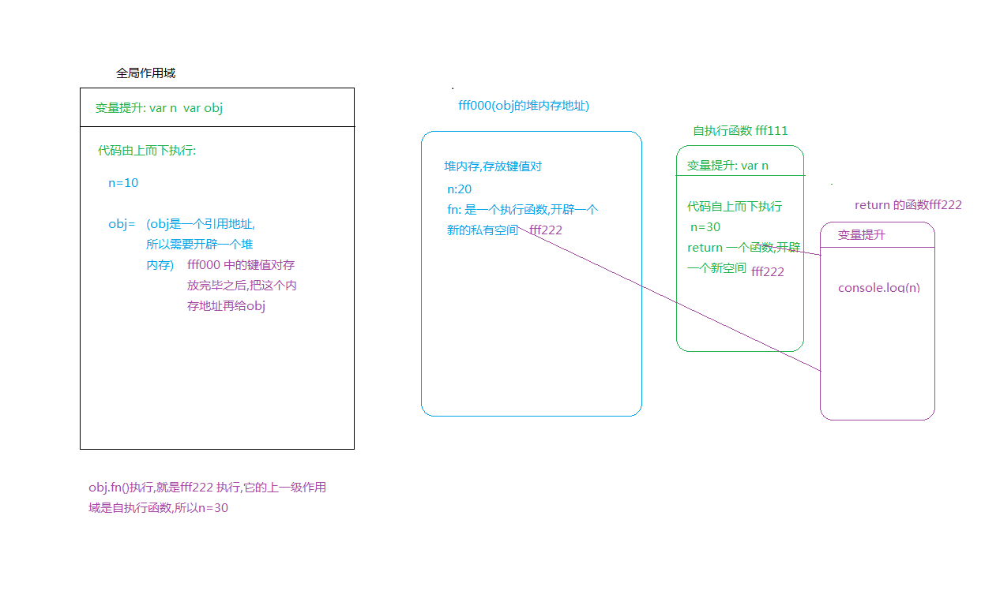

###如何查找上级作用域###

 > 函数执行,形成一个私有的作用域a,a 的上一级作用域是谁,和它在哪执行无关,主要是看他在哪里定义的,在哪个作用域下定义的,当前a的上一级作用域就是谁.

```javascript

   var n=10;
   function sum(){
     console.log(n)----10  当前上级作用域是window
   }
   
   sum()
```

```javascript

   var n=10;
   function sum(){
     console.log(n)----10  当前上级作用域是window
   }
   
~function(){
   var n=100;
   sum() // 上级作用域和函数在哪执行没关系,只跟在哪定义有关,所以此时它的上一级作用域还是window 下的n
}()
   
答案:依旧打印10
```

```javascript

   var n=10;
   var obj={
       n:20,
       fn:(function(){
          var n=30;
          return function(){
             console.log(n)
          }
       })()
   }

obj.fn()
```


下面我们再对上题做下改变:

```javascript

  var n=10;
   var obj={
       n:20,
       fn:(function(){
         
          return function(){
             console.log(n)
          }
       })()
   }
obj.fn()

```
此时输出的结果:10, return 函数的上一级作用域是自执行函数,自执行函数里面没有私有变量n,接着向上一级查找,(注意此时的上级作用域不是obj,obj 只是一个堆内存) 它的上级作用域就是window 所以打印10


`接下来我们再做个改变`

```javascript

  var n=10;
   var obj={
       n:20,
       fn:(function(n){
          return function(){
             console.log(n)
          }
       })(obj.n)
   }
obj.fn()


```
`答案:此时报错,Uncaught TypeError: Cannot read property 'n' of undefined`,因为obj是一个堆内存,这个堆内存的地址是在键值对都赋值完成之后,才会给obj的,当给obj 的键fn 赋值的时候,值为一个自执行函数,而自执行函数中传的实参用到了obj,此时obj还没形成引用地址,所以会报错


