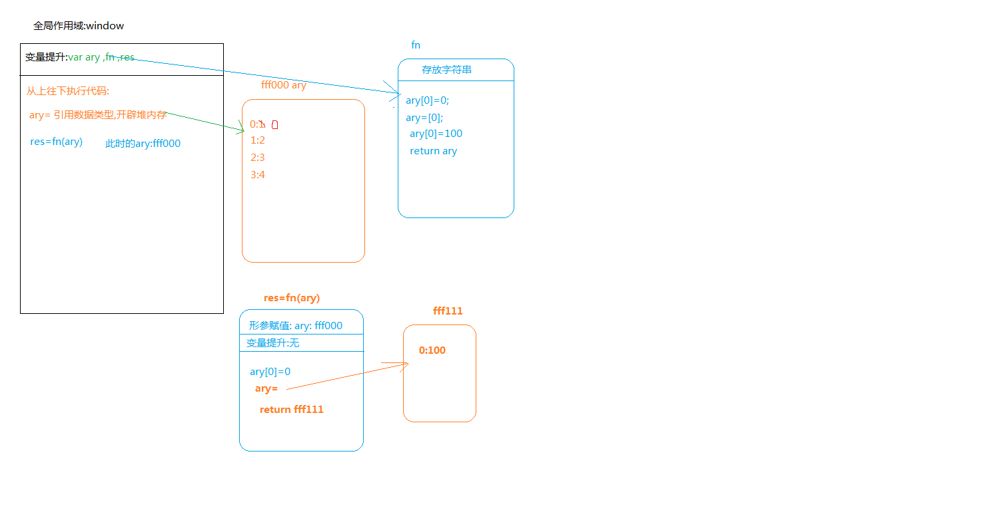

### 单张图片的延迟加载

```javascript
<!DOCTYPE html>
<html lang="en">
<head>
    <meta charset="UTF-8">
    <meta name="viewport" content="width=device-width, initial-scale=1.0">
    <meta http-equiv="X-UA-Compatible" content="ie=edge">
    <title>Document</title>
    <style type="text/css" >
      *{margin:0;padding:0}
      body,html{width:100%;height:100%;}
      #main{width:100%;height:2000px;background:pink;}
      #top{width:600px;height:1300px;}
      #imgbox{width:100px;height:100px;overflow:hidden;}
      imgbox img{width:100%;height:100%;}
    </style>
</head>
<body>
   <div id="main">
        <div id="top"></div>
        <div id="imgbox"></div>
   </div>
   
</body>
</html>
<script>
 // 图片的延迟加载:当没有滚动到图片的位置时,显示的是默认的图片,当滚动到了,再换位真实的图片.
 /*
   怎么判断是否滚动到了图片的位置?
   1\可视区域底边到body顶部的偏移量=如果滚动条滚动的距离(页面卷进去的高度)+浏览器可视区域的高度
   2\图片底边到body顶部的偏移量
   1和2做对比,如果1的高度>=2 的高度,就说明图片在可视区域内,就改换链接了.
 */

//获取单张图片盒子imgbox 到body的偏移量
var oimgbox=document.getElementById("imgbox");
var oimg=oimgbox.getElementsByTagName("img")[0];
function doc(attr,val){
   if(typeof val=="undefined"){
     return document.documentElement[attr]||document.body[attr]
   }
   document.documentElement[attr]=val;
   document.body[attr]=val
}
window.onscroll=function(){
    var wH=doc('clientHeight')+doc("scrollTop")
    var imgTop=offset(oimgbox).top;
    if(wH>=imgTop){
        /*不能直接这么赋值,如果真实的图片的不存在,那样出来的就是一张碎图,
        *还不如显示默认图,我们要确保图片真实存在再替换
        */
        //oimg.src=oimg.getAttribute("zsrc");
        var zsrc=oimg.getAttribute("zsrc");
        var temImg=new Image();
        temImg.src=zsrc;
        temImg.onload=function(){
            //图片正常加载的时候,才会进入这个里面.
            oimg.src=oimg.getAttribute("zsrc");
        }
    }

}

 function offset(ele){
    var op=ele.offsetParent;
    var left=ele.offsetLeft;
    var top=ele.offsetTop;
    while(op.tagName.toLowerCase()!="body"){
        if(window.navigator.userAgent.indexOf("MSIE 8.0")>-1){
            //ie 8
            left=left+op.offsetLeft;
            top=top+op.offsetTop
        }else{
            left=left+op.offsetLeft+op.clientLeft; //clientLeft ????
            top=top+op.offsetTop+op.clientTop;     //clientTop ????
        }
        op=op.offsetParent;
    }
    return {"left":left,"top":top}
 }
 


  

</script>
```