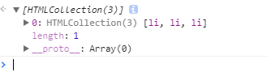
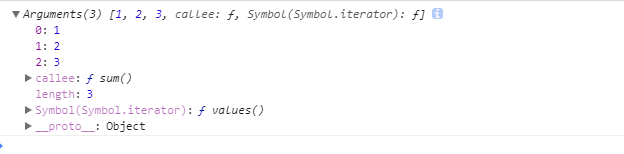

### 类数组转为数组

模拟Array的slice方法实现数组的克隆

```javascript

   Array.prototype.slice=function(){
      var ary=[];
      for(var i=0;i<this.length;i++){
        ary.push(this[i])
      }
     
      return ary;
   }

   [1,2,3].slice();
```

按照上面的思想,把arguments转为类数组

```javascript

   function fn(){
     
     var ary=[];
     for(var i=0;i<arguments.length;i++){
       ary.push(arguments[i])
     }
     return ary
   }

   fn(6,7)
```

> arguments 虽然不是数组,但是它和数组非常的相似,我们对比上面两种方法,其实很相似,只有一点不同,就是slice里面的for循环用的this,即slice方法执行的主体,而 arguments 转为类数组的时候,for循环是arguments. 所以我们其实可以把slice 里面的this 换为argumets ,那么就是把arguments 转换为了类数组.看下面的简单方法


```javascript

   function fn(){
     
    return  [].slice.call(arguments,0)
    
   }

   fn(6,7)
```

接下来我们来出一道题:求一组成绩的平均分.(10,20,30,60,80)

> 需求分析:求一组成绩的平均分,先排序,去掉最小值,最大值,然后把剩下的成绩相加求平均数


```javascript


   function avg(){
      //把类数组转化为数组
     var ary= [].slice.call(arguments,0);
     ary.sort(function(a,b){
        return a-b
     })
     ary.shift();
     ary.pop();
     var total= eval(ary.join("+"))
     return (total/ary.length).toFixed(2)

   }


 console.log(avg(10,20,30,60,80))

```

用另一种思想来求平均数

```javascript

function avg(){
     [].sort.call(arguments,function(a,b){
         return a-b
     });
   
     [].shift.call(arguments);
     [].pop.call(arguments);
    
     var total=eval([].join.call(arguments,"+"));
     console.log(total)
     return (total/arguments.length).toFixed(2)


   }


 console.log(avg(10,20,30,60,80))


```

>  借用数组原型上的slice方法把我们的类数组转化为数组，对于arguments来说兼容所有的浏览器，但是对于DOM元素/节点集合来说在IE6~8不兼容


### 类数组转换之元素集合的转换问题

类数组转换为数组到底该不该加形参的问题

```javascript

  第一种:不加形参

  function lickAry(){
    var ary=[]
  
    try{
     
    ary= [].slice.call(arguments,0)

    }catch(e){

      for(var i=0;i<arguments.length;i++){
        ary.push(arguments[i])
      }
    }
    
   return ary
  }

var f=lickAry(1,2,3) //[1,2,3]


```

上面看着还正常,但是如果我们获取到的是一组元素的话,就出现问题了

```javascript

 var oul=document.getElementById("ul");
 var olis=oul.getElementsByTagName("li");
 
 //再调用

var f2=lickAry(olis)

  

```
此时问题就出现了,我们在lickAry里面打印一下arguments






所以我们把类数组转换为数组的通用方法改为

```javascript

function AryLick(likeAry){
        console.log(likeAry)
        var ary=[];
        try{
           ary= [].slice.call(likeAry,0)
        }catch(e){
           for(var i=0;i<likeAry.length;i++){
             ary.push(likeAry[i])
           }
        }

        return ary;
    }


```
> 有了形参,一切就正常了.

总结一句:类数组转为数组的时候 ,通用方法必须用形参,不能用arguments.


