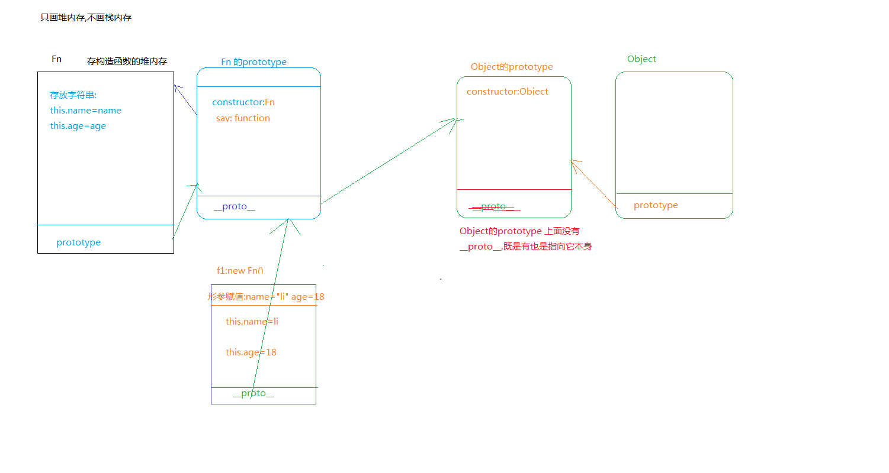
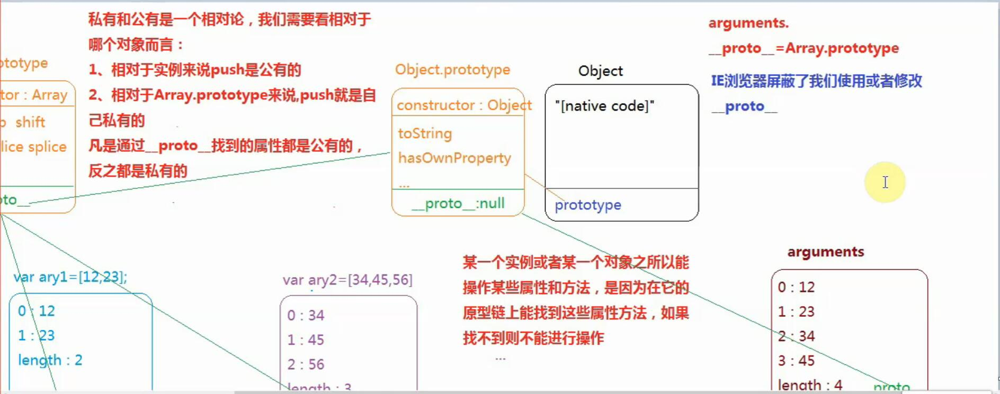

### 单例模式###


> 在真实项目中,我们为了实现模块化开发,或者团队协作开发,我们经常会使用单例模式.(一般业务逻辑部分的代码都是依托单例模式设计规划)

 单例模式:我们用对象数据类型来实现,把描述同一个事务的属性或者特征归纳在一起,防止全局变量冲突,这种思想叫'单例设计模式'.

```javascript

   var person1={
         name:"lili",
         age:"18"
       }

   var person2={
         name:"dav",
         age:"21"
       }
```

> 单例模式

  此时的singelton不仅仅是对象名字,在`单例模式`中被称为"命名空间"

```javascript
   
   var singelton={
         ***:***
         
       }

```
 > 把描述同一件事务的属性和特征放在一个命名空间里,多个命名空间里的属性和方法是互不干扰的.


### 使用单例模式实现模块化开发

模块化开发:在团队协作开发的时候,我们经常把一个复杂的页面划分为几大块,分别进行开发,这种模块划分的思想,就是模块划分的思想.

> 真实项目中,我们可以使用单例模式,来实现我们的模块开发

###高级单例模式:

基于惰性思想,并且可以把我们常用的模式,例如:命令模式,发布订阅模式,promise设计模式等融合进来.

var search=(function(){
             function fn(){}
             return {
                fn:fn
             }

           })()


search.fn()

###面向对象(oop)###

> 对象,类,实例

 对象:编程语言中的对象是一个抽象泛指,万物皆对象.我们所要研究学习的都是东西.

 类:按照属性或者特征,把对象细分中一些类别

 实例:某一类中具体的事物就是实例.

js本身就是基于面向对象创造出来的语言,我们学习的时候也是首先给其分类,我们拿出某一类中的一个实例进行学习和研究,那么这个类的其它实例也具备这个特征.

###js中常用的内置类

> 关于数据类型的

 > - Number 类:每个数字或者NaN 都是Number类的一个实例
 
> - String 类

> - Boolean 类

> - Null 

> - Undefined:浏览器屏蔽了Null 和Undefined 类的操作

>关于引用数据类型

> - Object 类:每一个对象都是它的一个实例
   
    Array

    Regexp

    Date

   ...

> - Function类:每一个函数都是它的一个实例


面向对象:就是 我们那出其中的一个实例进行研究,这个类的其它实例也具备这样的特点,这就是面向对象.

> -

dir(document.getElementsByTagName("div")[0])


HTMLDivElement----HTMLElement----Element----Node---EventTarget---Object

***实例和类***


###基于面向对象创建数据值

> 1.var ary1=[1,2,3] //字面量的创建方式

> 2.var ary2=new Array(10) //构造函数创建方式


以上两者都是创建一个数组的实例,但是在语法上有所区别.字面量创建方式,传递进来什么都是给每一项添加的内容.
但是构造函数,
 > 1. new Array(10),如果只传递进来一个参数,并且是number类型,创建一个长度为10的数组,每一项都空.
 > 2. new Array('10'),如果只传递一个实参,但是是字符串,此时就是创建了一个["10"]这样的数组
>  3. new Array(1,2,3,4,5) 传递多个参数的时候,就是创建[1,2,3,4,5]


var obj={"name":"lili"}

var obj=new Object() //一般只用来创建空对象,如果需要增加键值对,创建完成后再依次添加.

引用数据类型用字面量和构造函数两种方法创建只是语法不同,但是基本数据类型通过构造函数方法创建之后,数据类型都变成了object,但是依然是当前类的实例.

var num=12 --- typeof num -----"number"

var num2=new Number(12)  typeof num2-----"Object"


###构造函数设计模式

 使用构造函数方式,主要是为了创建类和实例,基于面向对象思想来实现需求处理.

 ```javascript

    function Fn(){
      this.name="lili"
    }
    
    var f=new Fn()
```
构造函数:当new Fn() new一个方法执行的时候,此时的Fn 就不是一个普通的函数,而是一个类,而小f 就是当前Fn这个类的实例,这种方式就是构造函数方式.(我们一般会把类名的首字母大写).

构造函数:
   1.形成一个私有作用域
   2.形参赋值,变量提升
   3.浏览器会自动创建一个对象数据类型,并且把this指向这个对象数据类型,而this就是当前这个类的实例.
   4.自上而下执行代码
   5.会把创建的这个对象返回给函数的外面


typeof f ===="object"

###深入理解构造函数

  ```javascript

      function Fn(){
      this.name="lili"
    }
    
    var f=new Fn();
     var f1=new Fn()
 ```
在构造函数,创建实例的时候 ,如果不传递参数,后面的小括号可以省略.

```javascript

   function fn(){
     var num=100;
     this.name="lili"
     this.sum=function(){}
   }

   var f1=new fn()
   var f2=new fn()
   console.log(f1.num)-------//"undefined"
   console.log(f1.name)-----//"lili"
   console.log(f1===f2)-----//false
 console.log(f1.sum===f2.sum) //false
```
通过构造函数创建出来的实例都是单独独立的个体,实例和实例是不相同的.在构造函数中通过this给实例添加的属性,都是当前实例的私有属性.

如果构造函数中,默认返回的是一个实例,是一个对象类型的值.我们手动设置了return了一个基本数据类型的值,最后返回的值依然是实例没任何影响,但是如果手动return的是一个引用数据类型的值,就会把浏览器默认的return 替换掉,不再是一个实例.


```javascript
   
   function Fn(){
    
     this.name="lili"
     return 10
    
   }

var f1=new Fn();

console.log(f1)----Fn {name: "lili"}


function Fn(){
    
     this.name="lili"
     return {"name":"gb"}
    
   }

var f2=new Fn();  
console.log(f2);-------{name: "gb"}

```
检测数据类型的几种方法

https://www.cnblogs.com/zt123123/p/7623409.html

> - typeof
> - instanceof

> - constructor

> - Object.prototype.toString.call()


instanceof:检测当前实例是否隶属于某个类,如果属于返回true,不属于返回false.

```javascript
   
  function Fn(){
   
     this.name="lili"
    
    
   }

var f1=new Fn();

f1 instanceof Fn


/^ $/ instanceof RegExp  true

[] instanceof Array

```

instanceof 解决了typeof 区分不了数组 正则的问题


### hasOwnProperty Vs in

> in 用来检测当前属性是否隶属于某个对象,不管是私有还是公有,只要有就是true

> hasOwnProperty 用来检测当前属性是否是某个对象的私有属性.不管公有有没有,只要私有有就是true.
  
  hasOwnProperty 是Object类的一个属性方法,只要是Object这个类的实例,就可以用这个方法.

```javascript

   var obj={
       name:'lili',
       age:18
   }
  
   'name' in obj  //true

   'sex' in obj // false

   obj.hasOwnProperty('toString') //false

   obj.hasOwnProperty('hasOwnProperty') //false

```

//检测一个属性是否是一个对象的公有属性,特点:1.对象的一个属性,2不是对象的私有属性

```javascript

   function hasPubProterty(attr,obj){

       if(attr in obj && !obj.hasOwnProperty(attr)){
         return true
            
       }else{
         return false
       }

   }

 hasPubProterty('hasOwnProperty',{"age":18})
    

```

###原型和原型链

js中对象和函数汇总:

> 对象数据类型:

> - {},

> - [],

> - Date,

> - RegExp,

> - Math,

> - 类的实例

> - 函数的prototype

> - \__proto__

函数:
  
> - 普通函数

> - 所有的类都是函数


###原型

> 1.所有的函数都天生自带一个属性prototype,它是一个对象数据类型,该对象存储了当前类需要给实例使用的公用的属性或者方法.

> 2.在函数的prototype 这个对象上,浏览器会默认开辟一个堆内存,在这个堆内存中,天生自带一个属性constructor(构造函数),constructor存储的值指向当前的类本身.

> 3.每一个类的实例,每个对象都天生自带一个属性__proto__,它也是对象数据类型,属性值是当前对象所属类的原型.

```javascript

  function Fn(name,age){

    this.name=name,
    this.age=age,
    
  }

  Fn.prototype.say=function(){
    console.log(this)
  } 

  var f1=new Fn("li",18)
  var f2=new Fn("jing",21)

```

根据以上代码来话原型图




arguments 是类数组,但是属于object类型



### 在原型上批量扩展属性和方法

```javascript

   function Fn(){
      this.name=name
   }

  var f1=new Fn;


```

// 如果想往原型上添加方法

 Fn.prototype.say=function(){}

 Fn.prototype.eat=function(){}

 .....
 这样很麻烦,我们可以用一下方法:

> 1.起一个别名

  ```javascript

  var pro=Fn.prototype

  pro.say=function(){}

  pro.eat=function(){}

```

>2.重构原型

```javascript

  Fn.prototype={
      //让原型指向自己开辟的堆内存,有一个问题,自己开辟的堆内存没有constructor这个属性,所以实例在调取constructor的时候找的是Object的,这样不好,所以我们此时应该重新设置下,保持机制的完整性.
      constructor:Fn,
      say:function(){},
      eat:funcrtion(){}
  }

```

但是这种方法有个弊端:重新做原型指向后,之前在浏览器中默认存放的方法和属性都没有了(默认的内存空间会被销毁),只有我们新开辟的内存中存贮的方法和属性才是有用的.但是如果是内置类的话,不能用这个方法

### 基于内置类的原型扩展方法

我们新增加的方法最好添加一个前缀,防止新增的方法和内置的方法冲突,把内置方法替换掉了

```javascript

//在内置类上扩展数组去重
Array.prototype.myunique=function(){
  //当前this就是ary

       var obj={};
       for(var i=0;i<this.length;i++){
           var item=this[i]
          if(obj[item]==item){
             this.splice(i,1);
             i--;
             continue;
          }
          obj[item]=item
       }
     
  return this

}   


var ary=[1,2,1,1,2]

console.log(ary.myunique())

```
链式写法:执行一个方法之后,返回值依然是当前类的一个实例,这样就可以继续调取当前类的一个方法.

ary.sort(function(a,b){
 return a-b
}).push(100)

ary.sort(function(a,b){
 return a-b
}).push(100).splice(1,1) //报错,因为 执行完.push(100)之后返回的值是一个数组的长度,即数字类型,不是数组的一个实例,所以就不能调取splice()方法了


内置类练习题:实现一个需求(3).pluss(2).minus(1) 实现链式写法.

```javascript

 Number.prototype.pluss=function(){
      var num=Number(arguments[0])||0
      return Number(this)+num
    }

    Number.prototype.minus=function(){
          var num=Number(arguments[0])||0
         return Number(this)-num
    }


     
     console.log((3).pluss(2).minus(1))

```


 


